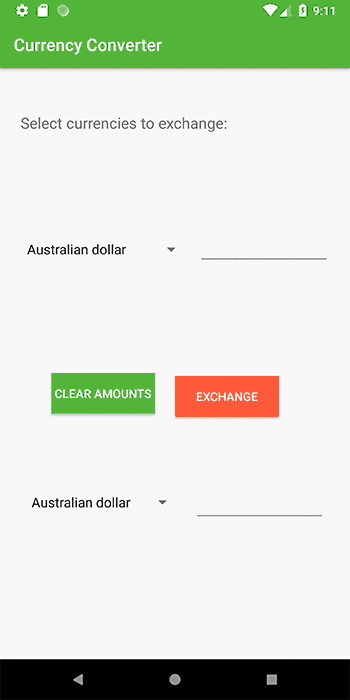

# Currency Converter

## Motivation

The last lab of my Interfacing course at Algonquin was a Currency Converter Android app written in Java. After the course was completed, I decided to try rewriting the application in Kotlin and expanding the conversion from CAD to multiple other currencies.

I also implemented saving the exchange rate information obtained from the Bank of Canada API to limit the number of API calls made by the application to once a day, regardless of the number of times the application is launched.